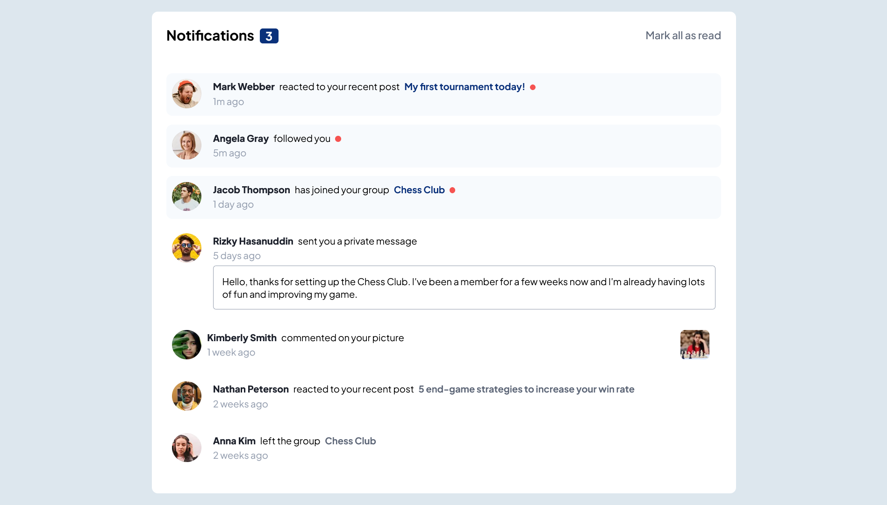

# Notifications Page

This project is a simple notifications page template. The page displays a list of notifications with options to mark them as read. It is built using HTML and CSS, and includes a basic JavaScript file for potential functionality.

This is a solution to the [Notifications page challenge on Frontend Mentor](https://www.frontendmentor.io/challenges/notifications-page-DqK5QAmKbC). Frontend Mentor challenges help you improve your coding skills by building realistic projects. 

## Table of Contents

- [Screenshot](#screenshot)
- [Usage](#usage)
- [Links](#links)
- [Technologies Used](#technologies-used)
- [Features](#features)
- [Author](#author)

## Screenshot

## Usage

- The notifications page can be used as a template for web applications that need to display user notifications.
- Customize the content in the HTML file and styles in the CSS file to match your application's needs.

## Links

- Solution URL: [Solution](https://your-solution-url.com)
- Live Site URL: [Demo](https://your-live-site-url.com)

## Technologies Used

- HTML5
- CSS3
- JavaScript

## Features

- **Responsive Design**: Ensures the notifications page is responsive and mobile-friendly.
- **Notification Management**: Displays a list of notifications with options to mark all as read.
- **User Avatars**: Includes user avatars for each notification to enhance the visual experience.

## Author

- Linkedin - [Basem Sameh](https://www.linkedin.com/in/basem-sameh-671b5b212/)
- Frontend Mentor - [@basemsameh](https://www.frontendmentor.io/profile/basemsameh)
